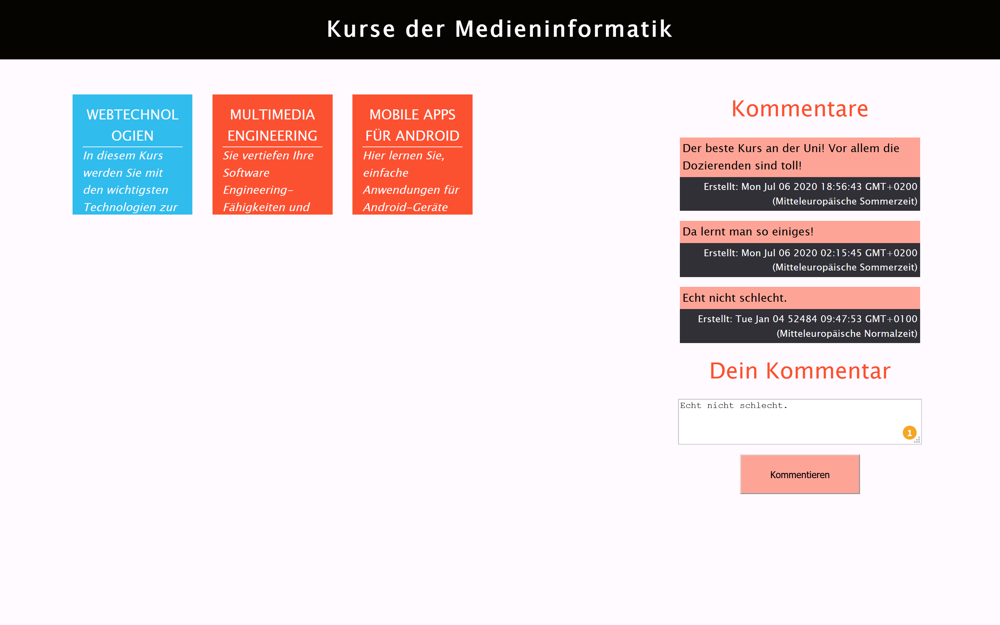

# Das Kursbuch

In diesem Repository finden Sie eine Anwendung zur Demonstration einer einfachen Web-Anwendung auf Basis von Node.js, einer *SQLite*-Datenbank und einem HTML/JavaScript-CLient. NutzerInnen der Browser-Anwendung können einzelne Kurse der Medieninformatik auswählen und Kommentare zu diesen einsehen bzw. ergänzen. Die Kommentare werden server-seitig Dauerhaft in der SQLite-Datenbank gespeichert. Als Schnittstelle zwischen Server und Client dient eine einfache HTTP-Schnittstelle auf Basis des `express`-Pakets.

## Aufbau

## Installation

Um die Anwendung auszuprobieren, führen Sie die folgenden Schritte durch:

1. Installieren Sie die [aktuelleste Version von Node.js](https://nodejs.org/en/download/current/) für Ihr Betriebsystem
